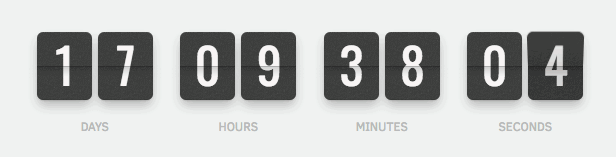

# Flip Countdown

Flip is an advanced and beautiful flip counter plugin. Easy to use and highly flexible, you can set up a custom counter on your website in minutes. Display visitor counts, countdown to a special date or celebrate progress. Whatever you’re planning, the options are endless.



[Learn more about Flip](https://pqina.nl/flip/) / [Learn more about Tick the engine that powers Flip](https://github.com/pqina/tick/)

---

[](https://www.buymeacoffee.com/rikschennink/)

[Buy me a Coffee](https://www.buymeacoffee.com/rikschennink/) / [Dev updates on Twitter](https://twitter.com/rikschennink/)

---


## Quick Start

If you just want to get on your way, copy the `example` directory and use it as a starting point.

This example will automatically initialize Flip counters on the website and can be used with the [presets on the demo site](https://pqina.nl/flip/#presets).

Or you can use one of the javascript framework codesandboxes below:
- [React](https://codesandbox.io/s/react-flip-demo-txoux)
- [Vue](https://codesandbox.io/s/vue-flip-demo-xhtfk)

## Setup

For the code snippets below we'll assume it's the `flip.min.css` and `flip.min.js` version and the folder we are uploading to is named `flip`.

Copy the following HTML snippet in the `<head>` of your web page.

```html
<link href="/flip/flip.min.css" rel="stylesheet">
```

Then copy the following snippet and place it just before the closing `</body>` tag.

```html
<script src="/flip/flip.min.js"></script>
```

Make sure the paths in the above code snippets match the location of the CSS and JS files.

You can now copy past the [presets](https://pqina.nl/flip/#presets) to your website and everything should function correctly.

You can also load the files from a CDN like unpkg using the links below:

```html
<link href="https://unpkg.com/@pqina/flip/dist/flip.min.css" rel="stylesheet">
```

```html
<script src="https://unpkg.com/@pqina/flip/dist/flip.min.js"></script>
```


### Install from NPM

```
npm i @pqina/flip --save
```

```js
import Tick from '@pqina/flip';

console.log(Tick);
// logs {supported: true, options: {…}, helper: {…}, data: {…}, DOM: {…}, …}
```

Module usage example project on Stackblitz: https://stackblitz.com/edit/flip-counter-module

## Docs

Information on how to customize Tick and use the Tick API can be found on the [product website](https://pqina.nl/tick/).


## Accessibility

For better compatibility with screenreaders, we need to hide the flip view using `aria-hidden`, this prevents the contents from being read out loud. We can then use an `aria-label` attribute to provide a formatted label instead.

```html
<div class="tick"
     data-value="1234"
     data-did-init="setupFlip">
  
    <!-- Hide visual content from screenreaders with `aria-hidden` -->
    <div data-repeat="true" aria-hidden="true">
        <span data-view="flip"></span>
    </div>
  
</div>

<script>
function setupFlip(tick) {

    Tick.helper.interval(function() {

        tick.value++;

        // Set `aria-label` attribute which screenreaders will read instead of HTML content
        tick.root.setAttribute('aria-label', tick.value);

    }, 1000);

}
</script>
```

## License

MIT License, Enjoy!
